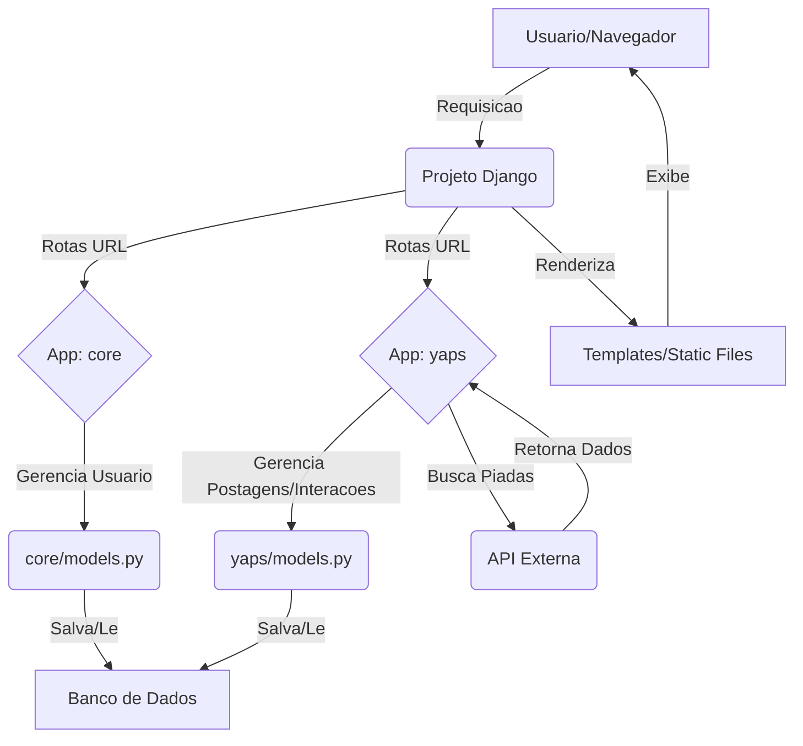
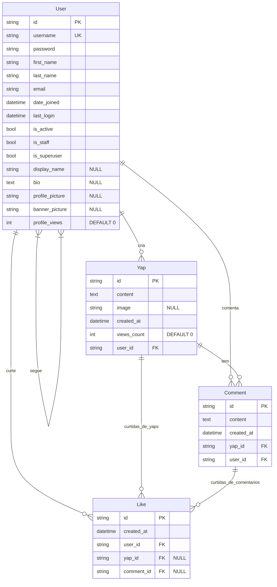

# Yapper!  Uma pequena rede social :)

## Apresentação do Sistema e conceitos

O Yapper é uma rede social, pensada inicialemente com o objetivo de ser um blog feito para a disciplina de programação Web como trabalho avaliativo.
Desenvolvida com Django (backend) e Bootstrap (frontend). O objetivo e permitir que usuarios compartilhem posts (Yaps), interajam com curtidas e comentarios, sigam outros perfis e personalizem suas paginas.

## De onde vem o nome?
De acordo com as definições encontradas em dicionários online da lingua inglêsa, como o urban dictionary ou o wiktionary, "Yapper" é uma pessoa que fala muito. Tendo essa definição em vista e o desejo de montar uma aplicação de rede social,
optei pela adoção do nome! É um nome que é de fácil e rápida pronúncia, ainda que seja um emprestimo de outro idioma.

## Stacks
* **Backend:** Python, Django
* **Frontend:** HTML, CSS, JavaScript, Bootstrap
* **Banco de Dados:** SQLite3
* **Controle de Versão:** Git, GitHub
* **API Externa:** icanhazdadjoke.com
## Funcionalidades da Aplicação

* **Autenticação e Perfil:** Cadastro, Login/Logout, perfil personalizavel (foto, banner, bio, nome de exibicao), visualizacao de perfil.
* **Interacao Social:** Seguir/Deixar de Seguir, Timelines (Geral, Para Voce, de Usuario), Yaps (posts) com texto e imagem.
* **Engajamento:** Curtidas em Yaps e Comentarios (AJAX), Adicao de Comentarios (modal), Exclusao de Yaps/Comentarios.
* **Busca:** Encontre perfis por username ou nome de exibicao.
* **Conteúdo Dinâmico:** Timeline geral com piadas aleatorias de API externa (cacheada).
* **Melhorias Visuais:** Dark Mode, Header fixo, botoes flutuantes, animacoes sutis.
## Fluxograma de lógica de Funcionamento

## Diagrama de Entidades e Relacionamentos

 
 
 # Tutorial de uso e Ativação Local

Este tutorial ira guiar voce na clonagem do repositorio do Yapper, instalacao das dependencias e como rodar a aplicacao em seu ambiente de desenvolvimento local.
## Pré-requisitos

Antes de comecar, certifique-se de ter os seguintes programas instalados em seu sistema:

* **Python 3.x:** Recomenda-se a versao 3.10 ou superior. (A versao utilizada no projeto foi Python 3.13.5).
* **pip:** O gerenciador de pacotes do Python (Para conferencia do pip -> "pip –version").
* **Git:** Para clonar o repositorio do GitHub.

## Passos para Configuração:

1.  **Clonar o Repositorio:**
    Abra seu terminal ou prompt de comando. Escolha um diretorio onde voce deseja armazenar o projeto e execute o comando Git para clonar o repositorio do Yapper:
    ```bash
    git clone https://github.com/GABESANCTI/Yapper.git
    ```

2.  **Navegar para o Diretorio do Projeto:**
    Apos a clonagem, navegue para o diretorio do projeto Yapper:
    ```bash
    cd yapper
    ```

3.  **Criar e Ativar Ambiente Virtual:**
    E uma boa pratica criar um ambiente virtual para isolar as dependencias do projeto das dependencias globais do seu sistema.

    * Crie o ambiente virtual:
        ```bash
        python -m venv venv
        ```
    * Ative o ambiente virtual:
        * **No Windows:**
            ```bash
            venv\Scripts\activate
            ```
        * **No macOS/Linux:**
            ```bash
            source venv/bin/activate
            ```
    (Voce deve ver `(venv)` no inicio da linha de comando, indicando que o ambiente esta ativo.)

4.  **Instalar Dependencias:**
    Com o ambiente virtual ativado, instale todas as bibliotecas Python necessarias listadas no arquivo `requirements.txt`:
    ```bash
    pip install -r requirements.txt
    ```

5.  **Configurar Banco de Dados e Migracoes:**
    O projeto utiliza SQLite3 como banco de dados. E necessario aplicar as migracoes para criar as tabelas no banco de dados local.

    ```bash
    python manage.py makemigrations
    python manage.py migrate
    ```

6.  **Criar um Usuario Administrador (Superuser):**
    Para acessar o painel de administracao do Django e criar usuarios ou Yaps inicialmente, voce precisara de um superusuario.
    ```bash
    python manage.py createsuperuser
    ```
    Siga as instrucoes no terminal para criar seu username, endereco de email (opcional) e senha.

7.  **Rodar o Servidor Local:**
    Agora voce pode iniciar o servidor de desenvolvimento do Django:
    ```bash
    python manage.py runserver
    ```
    O servidor estara rodando e observando por alteracoes nos arquivos.

8.  **Acessar a Aplicacao:**
    Abra seu navegador da web e acesse o endereco:
    ```
    Local: http://127.0.0.1:8000
    ```
    Voce sera redirecionado para a tela de login/cadastro.

    * O painel de administracao do Django esta disponivel em:
        ```
        http://127.0.0.1:8000/admin/
        ```
        (Para acessar use as credenciais do superuser que voce criou.)

## Observacoes Importantes (para Desenvolvimento Local)

* **Banco de Dados (SQLite3):** O arquivo `db.sqlite3` é criado na raiz do projeto. Se voce deletar este arquivo, perdera todos os dados e precisara executar `python manage.py migrate` e `python manage.py createsuperuser` novamente.
* **Arquivos de Midia (Uploads):** Imagens de perfil, banners e imagens de Yaps sao salvas na pasta `media/` na raiz do projeto. Estes arquivos nao sao versionados pelo Git (devido ao `.gitignore`). Se a pasta `media/` for deletada, os uploads serao perdidos.

---
